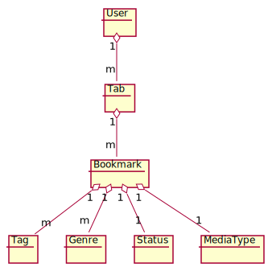

# Funktionelle krav
1. En favorit/bogmærke side, hvor man kan tilføje ens ... til forskellige lister til at holde styr på fx. hvor 
langt man er kommet i en serie, en film eller en bog. 

2. Et form for rating system af ens bogmærkede ting, samt en mulig begrundelse/note. (1-7 stjerne)

3. Tilføje tags/attributer som fx. genre, status og medietype.

4. Et bogmærke indeholder et navn på tingen samt et link (url) til hvor man kan finde eller har fundet den.
Hvis det er en serie eller lignende skal man kunne angive hvor langt man er kommet i den. I en bog skal det være
side og muligvis linenummer der brugs til at angive hvor langt man er kommet i den. 

5. Det skal det være muligt at søge og sortere via tags/attributer.

6. Det skal være koblet op til en database.

7. Udstiller et API til brug i en frontend applikation.  

# Domænemodel

# Use-Case

# Klassediagram